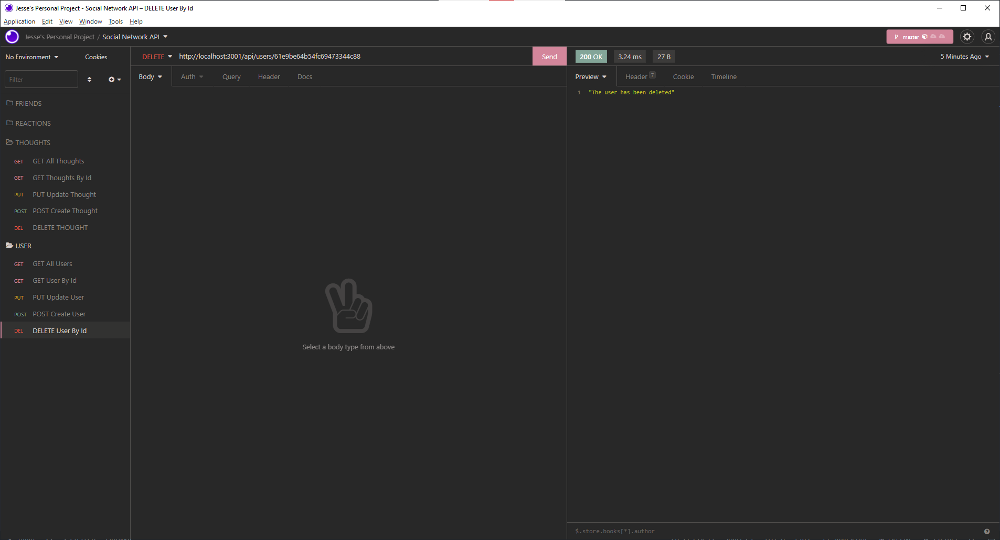
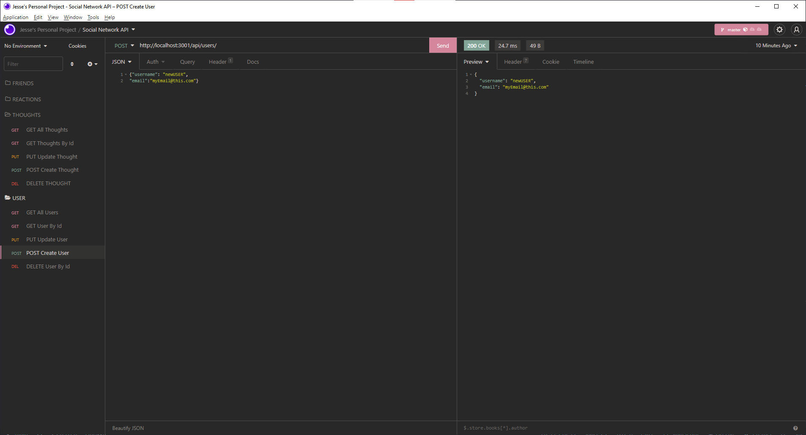

# Social-Network-API 
[](https://opensource.org/licenses/MIT)


## Table of contents
- <a href="#walkthrough">Walkthrough Video</a>
- <a href="#description">Description</a>
- <a href="#install">Installation</a>
- <a href="#usage">Usage</a>
- <a href="#testing">Testing</a>
- <a href="#contributors">Contributors</a>
- <a href="#contactMe">Contact me</a>
<br>

## User Story

```md
AS A social media startup
I WANT an API for my social network that uses a NoSQL database
SO THAT my website can handle large amounts of unstructured data
```

## <h2 id="walkthrough">Walkthrough Video</h2>
click <a target= _blank href="https://watch.screencastify.com/v/K16J8d75pUHbQZNPm7ZL">here</a> to see a walkthrough video of the application

<br>

## <h2 id="description">Description</h2> 
This project was designed to start working with NOSQL to construct our databases as well as connect to the server and handle requests. I have enjoyed getting to learn some more current platforms as well as better practices for building these databases. As as user the goal is to create a social media API that will handle various requests from users regarding their thoughts or friends on the platform. 

## <h2 id="install">Installation</h2>
all technologies used:
- express
- mongodb
- mongoose

## <h2 id="usage">Usage</h2>
feel free to clone/fork this assignment if you would like
<br>

## <h2 id="testing">Testing</h2>
n/a
## <h2 id="contributors">Contributors</h2>
Konado22 (myself)
## <h2 id="contactMe">Contact me</h2>
feel free to contact me through issues or at my email address jessedraper2@gmail.com
